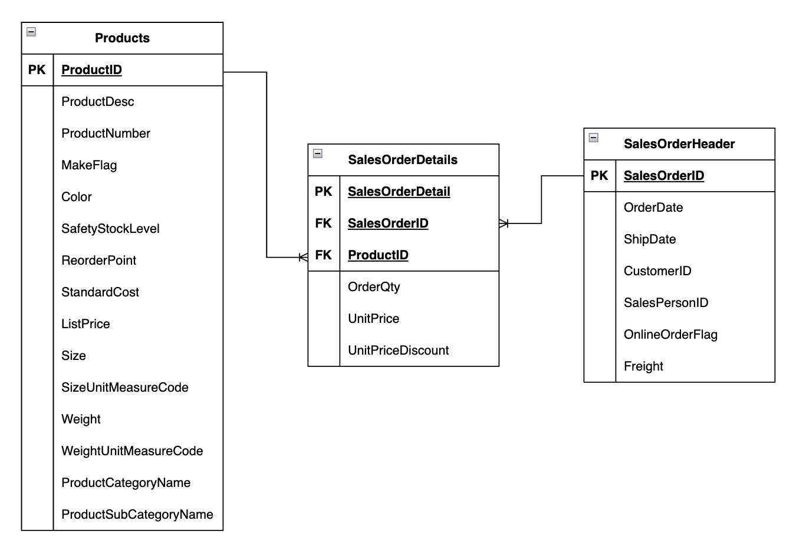

## SalesAnalysis

This repository simulates a Data Lake architecture, illustrating the full data processing flow: from raw ingestion to refined and analytics-ready datasets.

The project leverages three sales-related datasets:

Products: contains product-level information such as name, category, subcategory, color, and price details.
Sales Order Header: stores order-level information, including order and shipment dates, customer IDs, and freight costs.
Sales Order Details: provides item-level transaction data, linking each product to its respective order.

Throughout the project, you’ll find examples of data transformations, PySpark-based processing, and reusable utility functions for reading, writing, and managing data across multiple layers (bronze, silver, and gold).
Some analytical queries are also included to demonstrate potential business insights that can be extracted from the processed data.

